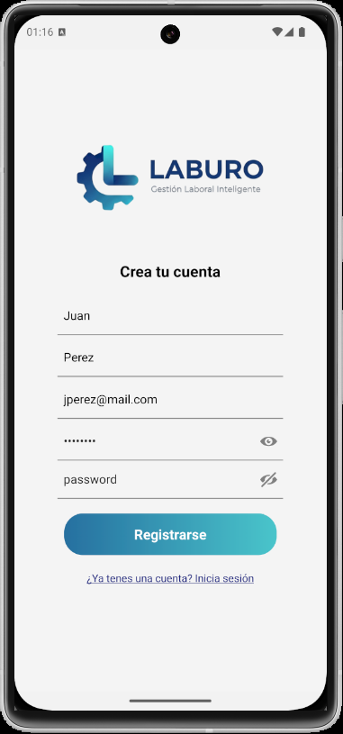
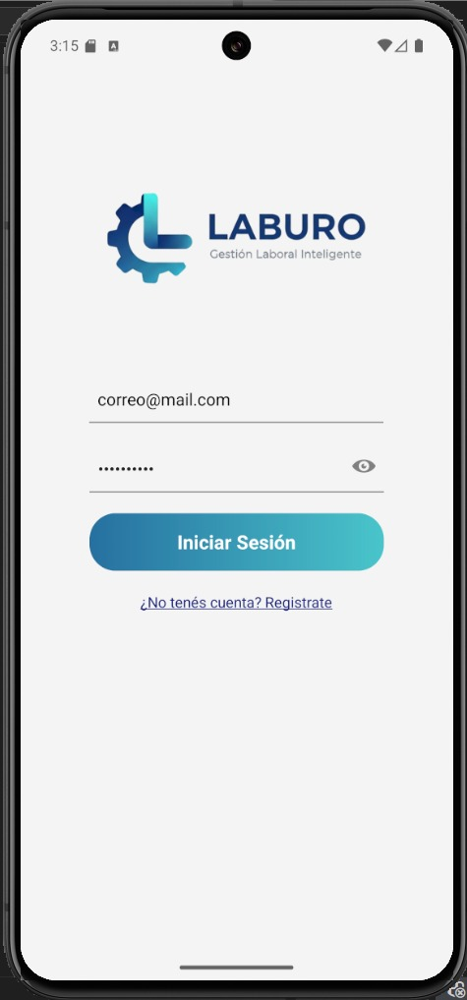
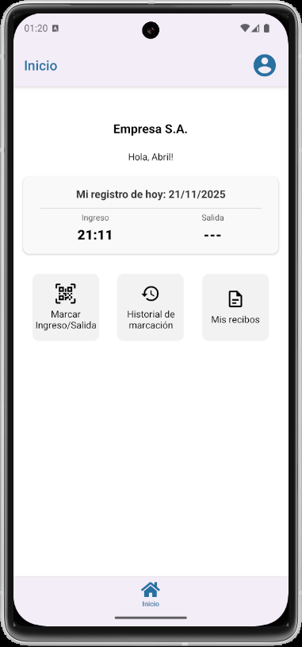
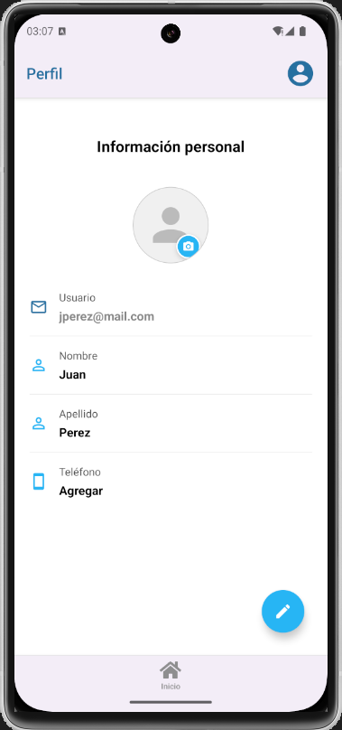

# LABURO: Gestión Laboral Inteligente
Integrantes:

Guillermo Alvarez  
Abril Basteiro  
Candela Natarelli   
Diana Delia Sandoval  

## Descripción
El proyecto consiste en una aplicación móvil para la gestión de empleados. 
Este programa cuenta con dos tipos de usuario: administrador y empleado.

Las acciones disponibles para el empleado son:
- Edición de su perfil (datos personales e imagen)
- Registro de inicio y finalización de su jornada laboral
- Acceso al historial de fichaje
- Acceso a sus recibos de sueldo
- Solicitud de licencias / vacaciones

Las acciones disponibles para el administrador son:
- Creación de nuevos usuarios
- Visualización de asistencia de los empleados
- Carga y visualización de recibos de sueldo
- Aprobación y visualización de solicitud de licencias
- Envío de notificaciones a los empleados

El registro de ingreso/egreso se realiza escaneando un código QR disponible en el lugar de
trabajo y validando que el usuario esté dentro de un radio geográfico permitido. 

---

## Pantalla de Registro
Permite al usuario crear su cuenta. Los datos requeridos son nombre, apellido, correo electronico y contraseña con confirmacion.

  
  

---

## Pantalla de Inicio de Sesión
Permite al usuario ingresar con su correo y contraseña.  

  
  

  

---

## Pantalla Principal
Muestra la asistencia del empleado en la jornada laboral actual.
Ademas, contiene accesos rapidos para acceder al perfil, al scanner para marcar el ingreso/egreso del trabajo, al historial de asistencia y a los recibos de sueldo.

---

## Pantalla de Perfil
Permite al usuario ver y editar sus datos personales y su foto de perfil

 
 

---
# Intrucciones para levantar la aplicación

## Backend

1) Instalar dependencias: `npm install`
2) Levantar contenedor `docker-compose up`
3) Cargar datos de prueba en la base de datos `npm run seed`
4) Iniciar la aplicaciòn `npm run start:dev`

Coleccion de postman: backend\src\docs\Laburo.postman_collection.js

---
## Frontend

1) Instalar dependencias: `npm install`
2) Iniciar la aplicación `npx expo start`