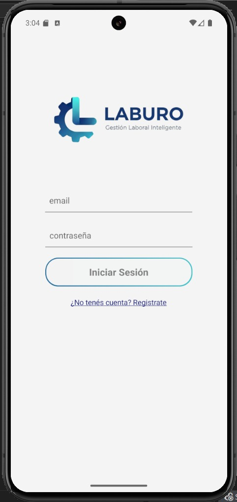
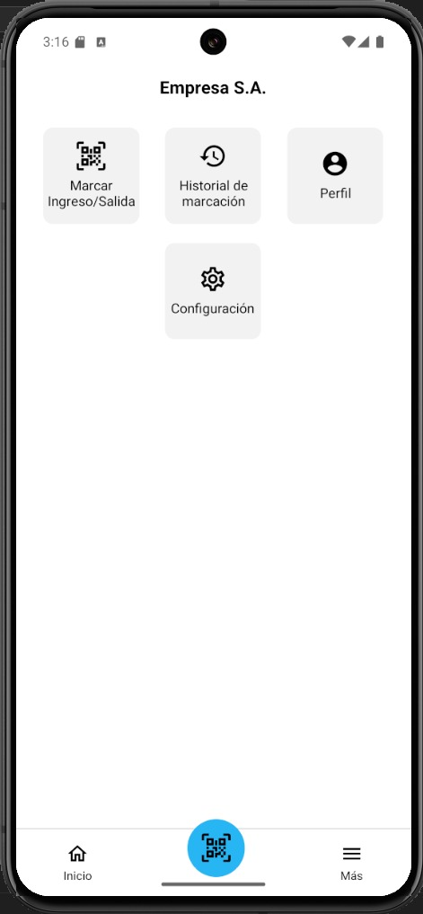
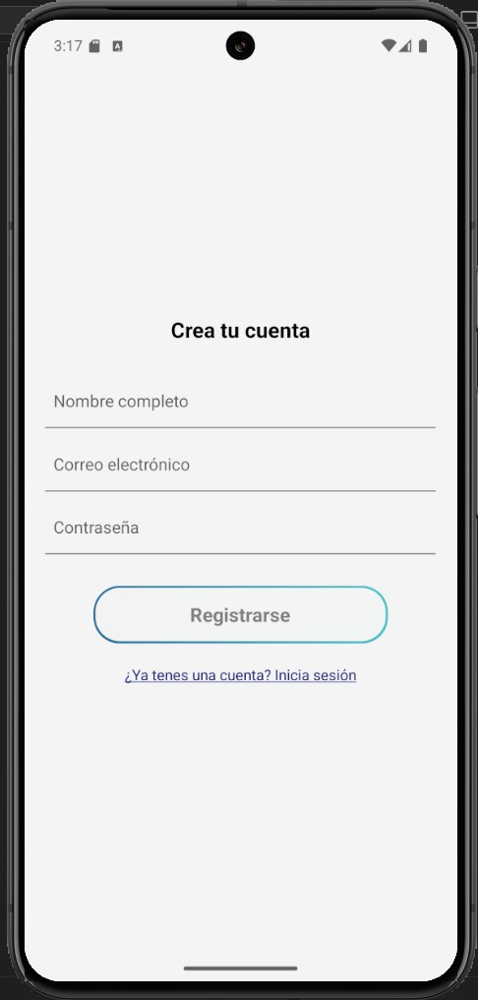

## LABURO: Gestión Laboral Inteligente
Integrantes:
Guillermo Alvarez, 
Abril Basteiro,
Candela Natarelli,
Diana Delia Sandoval

## Descripción
Este proyecto consiste en ua aplicación móvil para que las empresas registren el ingreso y salida de sus
empleados. El registro se realiza escaneando un código QR disponible en el lugar de
trabajo y validando que el usuario esté dentro de un radio geográfico permitido. La
app puede solicitar una foto del empleado al momento de marcar, evitando
suplantaciones. 

---

## Pantalla de Inicio de Sesión
Permite al usuario ingresar con su correo y contraseña.  

---

## Pantalla Principal
Muestra el menú principal y accesos rápidos a marcación de entrada/ salida, perfil, configuración y el historial de marcaciones. 

---

## Pantalla de Perfil
Permite al usuario editar sus datos personales.  

---
## Pantalla de Registro
Permite al usuario crear su cuenta, ingresando nombre, correo y una contraseña  

